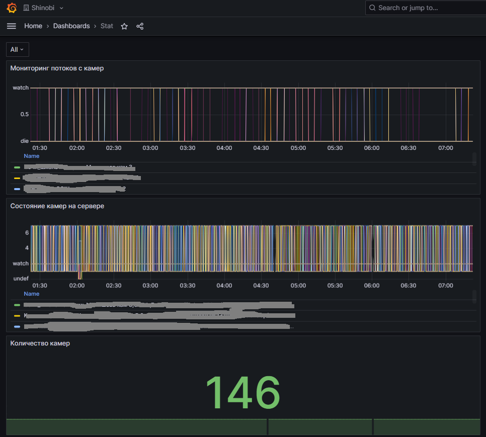
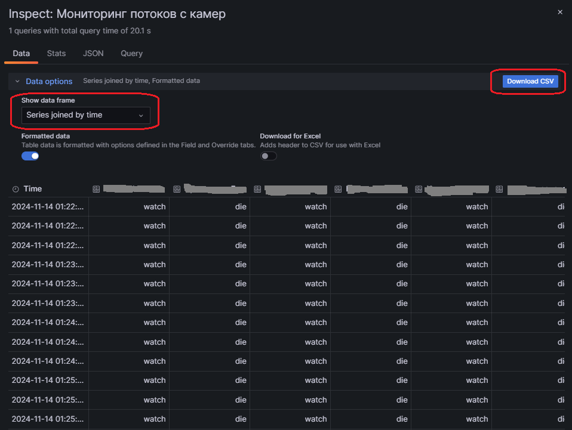
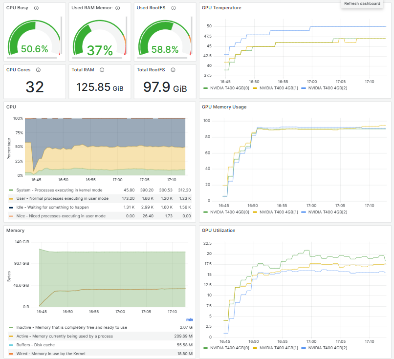

# shinobi-monitors-prober
## shinobi_streams
Скрипт [probe.py](shinobi-streams/prober.py) Осуществляет мониторинг состояния камер утилитой ffprobe.  
Для работы скрипта создать пользователя БД ccio с правами на чтение и прописать в скрипте.
Необходимо запускать скрипт по cron или средствами systemd-timer.
1. Из базы данных Shinobi запрашиваем список камер.
2. Опрашиваем потоки утилитой ffprobe.
3. Сохраняем данные в JSON формате в www-директорию.
Средствами pm2 запускаем отдельный http server, [конфигурация](shinobi-streams/http_server.js):
```
var connect = require('connect');
 var serveStatic = require('serve-static');

 connect()
     .use(serveStatic('/home/www')) # Путь к файлу JSON (п.3)
     .listen(8000, () => console.log('Server running on 8000...'));
```
Для сбора метрик в Prometheus используется json-exporter. Запускаем через docker-compose:
```
[..]
services:
  exp_json:
    image: quay.io/prometheuscommunity/json-exporter
    volumes:
      - ./etc/json_exporter/config.yml:/config.yml:ro
      - /etc/localtime:/etc/localtime:ro
    restart: unless-stopped
    ports:
      - "7979:7979"
    command:
      - '--config.file=/config.yml'
```
Конфигурация json-exporter:
```
modules:
  default:
    metrics:
    - name: shinobi_stream
      type: object
      path: '{ .monitors[?(@)] }'
      help: Shinobi stream status
      labels:
        environment: beta        # static label
        name: "{.name}"
        stream: "{.stream}"
        mid: "{.mid}"
      values:
        status: '{.status}'
    headers:
      X-Dummy: my-test-header
```
Конфигурация Prometheus:
```
  - job_name: json
    metrics_path: /probe
    params:
      module: [default]
    static_configs:
      - targets:
        - http://shinobi_host:8000/export_data.json
    relabel_configs:
      - source_labels: [__address__]
        target_label: __param_target
      - source_labels: [__param_target]
        target_label: instance
      - target_label: __address__
      ## Location of the json exporter's real <hostname>:<port>
        replacement: stat_host:7979
```
Для проверки используем запрос вида:
```
http://prometheus_host:7979/probe?module=default&target=http://shinobi_host:8000/export_data.json
```
## shinobi_monitors
Based on [shinobi-exporter](https://github.com/pavelgopanenko/shinobi-exporter/tree/main)  
Собирается статистика с сервера Shinobi.  
```
docker build -f Dockerfile  -t shinobi_exporter .  
docker-compose up -d  
```
## nvidia-smi-exporter
Мониторинг состояния видекарт посредством [nvidia-smi-exporter](https://github.com/zhebrak/nvidia_smi_exporter)  

## Examples
Графическое отображение:  

Гнерация отчетов:  

Мониторинг видеокарт:


